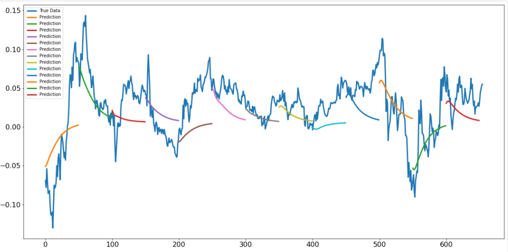

# LSTM Neural Network for Time Series Prediction

LSTM built using the Keras Python package to predict time series steps and sequences. Includes sine wave and stock market data.

[Full article write-up for this code](https://www.altumintelligence.com/articles/a/Time-Series-Prediction-Using-LSTM-Deep-Neural-Networks)

Output for stock market multi-dimensional multi-sequential predictions:

Output for sine wave sequential prediction:

## Requirements

Install requirements.txt file to make sure correct versions of libraries are being used.

* Python 3.5.x
* TensorFlow 1.10.0
* Numpy 1.15.0
* Keras 2.2.2
* Matplotlib 2.2.2
